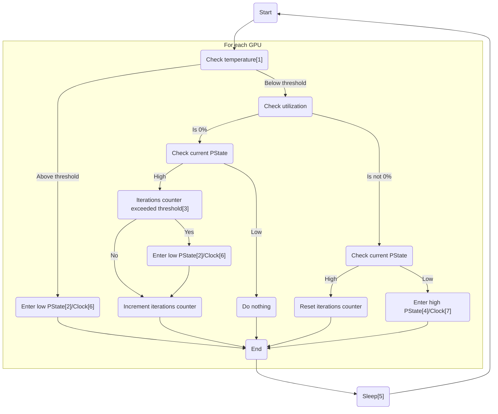

# nvidia-pstated

A daemon that automatically manages the performance states of NVIDIA GPUs.

## How it works



1 - Threshold is controlled by option `--temperature-threshold` (default: `80` degrees C)  
2 - Value is controlled by option `--performance-state-low` (default: `8`)  
3 - Threshold is controlled by option  `--iterations-before-switch` (default: `30` iterations)  
4 - Value is controlled by option `--performance-state-high` (default: `16`)  
5 - Value is controlled by option `--sleep-interval` (default: `100` milliseconds)  
6 - For GPUs without P-states support (like Tesla V100), low clock is controlled by options `--clock-mem-low` and `--clock-gpu-low`  
7 - For GPUs without P-states support (like Tesla V100), high clock is controlled by options `--clock-mem-high` and `--clock-gpu-high`  

## Installation

### Prerequirements

#### Linux

Make sure the proprietary NVIDIA driver is installed.

You will need the following libraries:

- `libnvidia-api.so.1`
- `libnvidia-ml.so.1`

Packages that provide these libraries:

- ArchLinux: `nvidia-utils`
- Debian: `libnvidia-api1` or `libnvidia-tesla-api1` (depending on the GPU and driver installed)

On Debian derivatives, you can use `apt search libnvidia-api.so.1` and `apt search libnvidia-ml.so.1` to find the package you need.

Note that you MUST run this daemon at the host level, i.e. where the CUDA Driver is available. You can NOT run this daemon in a container.


#### Windows

Make sure the NVIDIA driver is installed.

### Installation

Download the latest version of the executable for your OS from [releases](https://github.com/sasha0552/nvidia-pstated/releases).

## Building from source code

### Prerequirements

* CMake
* CUDA toolkit

### Building

```sh
# Configure
cmake -B build

# Build
cmake --build build
```

## Misc

### Managing only specific GPUs

You can use `-i`/`--ids` option to manage only specific GPUs.

Suppose you have 8 GPUs and you want to manage only the first 4 (as in `nvidia-smi`):

```sh
./nvidia-pstated -i 0,1,2,3
```

### Support for Tesla V100 and other GPUs without P-states

Some GPUs like the Tesla V100 don't support multiple P-states but can still benefit from clock control. The daemon automatically detects when P-state control fails and falls back to clock control.

You can configure the high and low clock frequencies:

```sh
# Set specific memory and GPU clocks (in MHz)
./nvidia-pstated --clock-mem-high 0 --clock-gpu-high 0 --clock-mem-low 877 --clock-gpu-low 135
```

Where:
- `--clock-mem-high 0`: Use automatic/maximum memory clock in high performance mode (default)
- `--clock-gpu-high 0`: Use automatic/maximum GPU clock in high performance mode (default)  
- `--clock-mem-low 877`: Use 877 MHz for memory clock in low performance mode  
- `--clock-gpu-low 135`: Use 135 MHz for GPU clock in low performance mode

If you don't specify the low clocks, the daemon will automatically find and use the lowest supported clocks.

To disable the clock control fallback entirely:

```sh
./nvidia-pstated --no-fallback-clocks
```

### systemd service

Install `nvidia-pstated` in `/usr/local/bin`. Then save the following as `/etc/systemd/system/nvidia-pstated.service`.

```text
[Unit]
Description=A daemon that automatically manages the performance states of NVIDIA GPUs
StartLimitInterval=0

[Service]
DynamicUser=yes
ExecStart=/usr/local/bin/nvidia-pstated
Restart=on-failure
RestartSec=1s

[Install]
WantedBy=multi-user.target
```

### Windows service

Place `nvidia-pstated.exe` in the desired location (for example, `C:\Program Files\nvidia-pstated\nvidia-pstated.exe`).

Create a new service using `sc.exe` in the elevated command prompt:

```sh
sc.exe create nvidia-pstated start=auto binPath="C:\Program Files\nvidia-pstated\nvidia-pstated.exe --service"
```

Then start the service:

```sh
net start nvidia-pstated
```

### vGPU manager

If you are using a hypervisor (KVM) with a vGPU manager, you cannot run `nvidia-pstated` in virtual machines. Instead, you can run it at the hypervisor level.

To do this, you need to:
1. Extract `libnvidia-api.so.1` from your guest driver (in my case `Guest_Drivers/nvidia-linux-grid-535_535.183.06_amd64.deb/data.tar.xz/usr/lib/x86_64-linux-gnu/libnvidia-api.so.1`) to some directory.
2. Download `nvidia-pstated` to the same directory.
3. Try running `nvidia-pstated`: `LD_LIBRARY_PATH=. ./nvidia-pstated`.
   You should get the following:
   ```sh
   $ LD_LIBRARY_PATH=. ./nvidia-pstated
   NvAPI_Initialize(): NVAPI_ERROR
   ```
   Check `dmesg`, you should get the following message:
   ```text
   NVRM: API mismatch: the client has the version 535.183.06, but
   NVRM: this kernel module has the version 535.183.04.  Please
   NVRM: make sure that this kernel module and all NVIDIA driver
   NVRM: components have the same version.
   ```
5. Use `sed -i 's/535.183.06/535.183.04/g' libnvidia-api.so.1` (replace the values with what you got in `dmesg`) to replace the client version in `libnvidia-api.so.1`.
6. Run `nvidia-pstated`: `LD_LIBRARY_PATH=. ./nvidia-pstated`. Enjoy.
