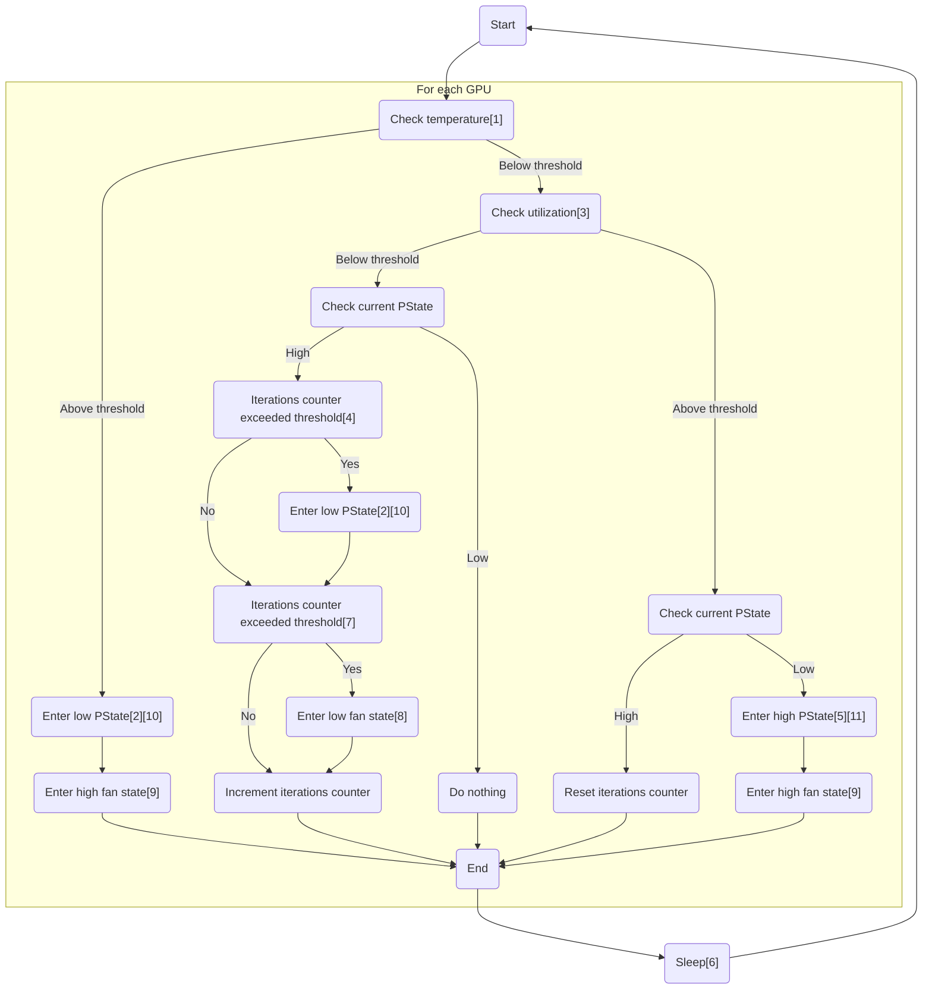

# nvidia-pstated

A daemon that automatically manages the performance states of NVIDIA GPUs.

## How it works


```mermaid
flowchart TD
    START(Start) --> CHECK_TEMPERATURE
    subgraph For each GPU
    CHECK_TEMPERATURE("Check temperature[1]") -->|Below threshold| CHECK_UTILIZATION
    CHECK_TEMPERATURE("Check temperature[1]") -->|Above threshold| ENTER_LOW_PSTATE_0
    ENTER_LOW_PSTATE_0("Enter low PState[2][10]") --> ENTER_HIGH_FAN_STATE_0
    ENTER_HIGH_FAN_STATE_0("Enter high fan state[9]") --> END
    CHECK_UTILIZATION("Check utilization[3]") -->|Below threshold| CHECK_CURRENT_PSTATE_0
    CHECK_UTILIZATION("Check utilization[3]") -->|Above threshold| CHECK_CURRENT_PSTATE_1
    CHECK_CURRENT_PSTATE_0(Check current PState) -->|High| ITERATIONS_COUNTER_EXCEEDED_THRESHOLD_0
    CHECK_CURRENT_PSTATE_0(Check current PState) -->|Low| DO_NOTHING
    ITERATIONS_COUNTER_EXCEEDED_THRESHOLD_0("Iterations counter exceeded threshold[4]") -->|Yes| ENTER_LOW_PSTATE
    ITERATIONS_COUNTER_EXCEEDED_THRESHOLD_0("Iterations counter exceeded threshold[4]") -->|No| ITERATIONS_COUNTER_EXCEEDED_THRESHOLD_1
    ENTER_LOW_PSTATE("Enter low PState[2][10]") --> ITERATIONS_COUNTER_EXCEEDED_THRESHOLD_1
    ITERATIONS_COUNTER_EXCEEDED_THRESHOLD_1("Iterations counter exceeded threshold[7]") -->|Yes| ENTER_LOW_FAN_STATE_1
    ITERATIONS_COUNTER_EXCEEDED_THRESHOLD_1("Iterations counter exceeded threshold[7]") -->|No| INCREMENT_ITERATIONS_COUNTER
    ENTER_LOW_FAN_STATE_1("Enter low fan state[8]") --> INCREMENT_ITERATIONS_COUNTER
    INCREMENT_ITERATIONS_COUNTER(Increment iterations counter) --> END
    DO_NOTHING(Do nothing) --> END
    CHECK_CURRENT_PSTATE_1(Check current PState) -->|High| RESET_ITERATIONS_COUNTER
    CHECK_CURRENT_PSTATE_1(Check current PState) -->|Low| ENTER_HIGH_PSTATE
    RESET_ITERATIONS_COUNTER(Reset iterations counter) --> END
    ENTER_HIGH_PSTATE("Enter high PState[5][11]") --> ENTER_HIGH_FAN_STATE_1
    ENTER_HIGH_FAN_STATE_1("Enter high fan state[9]") --> END
    end
    END(End) --> SLEEP
    SLEEP("Sleep[6]") --> START
```

1 - Threshold is controlled by option `--temperature-threshold` (default: `80` degrees C)  
2 - Value is controlled by option `--performance-state-low` (default: `8`)  
3 - Threshold is controlled by option `--utilization-threshold` (default: `0` %)  
4 - Threshold is controlled by option  `--iterations-before-switch` (default: `30` iterations)  
5 - Value is controlled by option `--performance-state-high` (default: `16`)  
6 - Value is controlled by option `--sleep-interval` (default: `100` milliseconds)  
7 - Threshold is controlled by option `--iterations-before-idle` (default: `9000` iterations)  
8 - Value is controlled by option `--disable-fan-script` (default: none)  
9 - Value is controlled by option `--enable-fan-script` (default: none)  
10 - In clock mode, values are controlled by options `--clock-gpu-low` (default: `0` MHz) and `--clock-mem-low` (default: `0` MHz)  
11 - In clock mode, values are controlled by options `--clock-gpu-high` (default: `0` MHz) and `--clock-mem-high` (default: `0` MHz)

## Installation

### Prerequirements

#### Linux

Make sure the proprietary NVIDIA driver is installed.

You will need the following libraries:

- `libnvidia-api.so.1`
- `libnvidia-ml.so.1`

Packages that provide these libraries:

- ArchLinux: `nvidia-utils`
- Debian: `libnvidia-api1` or `libnvidia-tesla-api1` (depending on the GPU and driver installed)

On Debian derivatives, you can use `apt search libnvidia-api.so.1` and `apt search libnvidia-ml.so.1` to find the package you need.

Note that you MUST run this daemon at the host level, i.e. where the CUDA Driver is available. You can NOT run this daemon in a container.


#### Windows

Make sure the NVIDIA driver is installed.

### Installation

Download the latest version of the executable for your OS from [releases](https://github.com/sasha0552/nvidia-pstated/releases).

## Building from source code

### Prerequirements

* CMake
* CUDA toolkit

### Building

```sh
# Configure
cmake -B build

# Build
cmake --build build
```

### Nix

This project provides a Nix flake to build the binary:

```sh
nix build
```

**NixOS Module:**

The flake also provides a NixOS module. To use it, add the flake to your inputs and import the module in your NixOS configuration.

`flake.nix`:
```nix
{
  inputs.nvidia-pstated.url = "github:sasha0552/nvidia-pstated";

  outputs = { self, nixpkgs, nvidia-pstated }: {
    nixosConfigurations.your-hostname = nixpkgs.lib.nixosSystem {
      # ...
      modules = [
        ./configuration.nix
        nvidia-pstated.nixosModules.default
      ];
    };
  };
}
```

`configuration.nix`:
```nix
{ config, pkgs, ... }: {
  # ...
  services.nvidia-pstated.enable = true;
}
```

## Misc

### Managing only specific GPUs

You can use `-i`/`--ids` option to manage only specific GPUs.

Suppose you have 8 GPUs and you want to manage only the first 4 (as in `nvidia-smi`):

```sh
./nvidia-pstated -i 0,1,2,3
```

### GPUs without performance states

Some GPUs (Tesla P100, V100, etc) expose only a single performance state (a memory clock), so `NvAPI_GPU_SetForcePstate` always fails on them and the daemon exits with:

```text
NvAPI_GPU_SetForcePstate(nvapiDevices[i], pstateId, 0): NVAPI_NOT_SUPPORTED
If GPU 0 does not support performance states, restart the daemon with --clock-mode.
```

On these GPUs you can use `-c`/`--clock-mode`, which controls the GPU clocks (as `nvidia-smi -lgc` does) instead of changing performance states:

```sh
./nvidia-pstated --clock-mode
```

By default, the daemon sets the graphics clock to the lowest clock the GPU reports in the low performance state, and restores the default clocks in the high performance state. Both values can be overridden with `--clock-gpu-low` and `--clock-gpu-high`:

```sh
./nvidia-pstated --clock-mode --clock-gpu-low 135 --clock-gpu-high 1380
```

Note that clock mode requires root/admin permissions.

#### Which mechanism is used

The daemon picks the mechanism per GPU, from its architecture:

| GPU              | Mechanism           | Memory clocks                                                                                                   |
| ---------------- | ------------------- | --------------------------------------------------------------------------------------------------------------- |
| Volta and newer  | Locked clocks       | Only managed if `--clock-mem-low` or `--clock-mem-high` is set, as locking them requires an Ampere or newer GPU |
| Older than Volta | Applications clocks | Always set, as the call takes both domains at once; defaults to the lowest supported clock                      |

Applications clocks are deprecated since NVML 13.0 and are removed in CUDA 14.0, so they are only compiled in when the CUDA toolkit used to build still provides them.

On GPUs older than Volta, `--clock-gpu-high` and `--clock-mem-high` have to be set together to pin the high performance state; if either is left at `0`, the default clocks are restored instead.

### Recovering from a crash

If the daemon is killed before it can restore the clocks (`SIGKILL`, power loss, etc), the GPUs are left at the low performance clocks. To restore the default ones:

```sh
# Volta and newer
nvidia-smi -rgc

# also needed if memory clocks were managed
nvidia-smi -rmc

# older than Volta
nvidia-smi -rac
```

### systemd service

Install `nvidia-pstated` in `/usr/local/bin`. Then save the following as `/etc/systemd/system/nvidia-pstated.service`.

```text
[Unit]
Description=A daemon that automatically manages the performance states of NVIDIA GPUs
StartLimitInterval=0

[Service]
DynamicUser=yes
ExecStart=/usr/local/bin/nvidia-pstated
Restart=on-failure
RestartSec=1s

[Install]
WantedBy=multi-user.target
```

### Windows service

Place `nvidia-pstated.exe` in the desired location (for example, `C:\Program Files\nvidia-pstated\nvidia-pstated.exe`).

Create a new service using `sc.exe` in the elevated command prompt:

```sh
sc.exe create nvidia-pstated start=auto binPath="C:\Program Files\nvidia-pstated\nvidia-pstated.exe --service"
```

Configure the service to be restarted if it crashes, so the GPUs are not left locked to the low performance clocks:

```sh
sc.exe failure nvidia-pstated reset= 0 actions= restart/60000/restart/60000/restart/60000
```

Then start the service:

```sh
net start nvidia-pstated
```

### vGPU manager

If you are using a hypervisor (KVM) with a vGPU manager, you cannot run `nvidia-pstated` in virtual machines. Instead, you can run it at the hypervisor level.

To do this, you need to:
1. Extract `libnvidia-api.so.1` from your guest driver (in my case `Guest_Drivers/nvidia-linux-grid-535_535.183.06_amd64.deb/data.tar.xz/usr/lib/x86_64-linux-gnu/libnvidia-api.so.1`) to some directory.
2. Download `nvidia-pstated` to the same directory.
3. Try running `nvidia-pstated`: `LD_LIBRARY_PATH=. ./nvidia-pstated`.
   You should get the following:
   ```sh
   $ LD_LIBRARY_PATH=. ./nvidia-pstated
   NvAPI_Initialize(): NVAPI_ERROR
   ```
   Check `dmesg`, you should get the following message:
   ```text
   NVRM: API mismatch: the client has the version 535.183.06, but
   NVRM: this kernel module has the version 535.183.04.  Please
   NVRM: make sure that this kernel module and all NVIDIA driver
   NVRM: components have the same version.
   ```
5. Use `sed -i 's/535.183.06/535.183.04/g' libnvidia-api.so.1` (replace the values with what you got in `dmesg`) to replace the client version in `libnvidia-api.so.1`.
6. Run `nvidia-pstated`: `LD_LIBRARY_PATH=. ./nvidia-pstated`. Enjoy.

### Controlling the fans from `nvidia-pstated`

You can control the external fans installed on the GPUs using `--disable-fan-script` and `--enable-fan-script`

For example, I have a server fans connected to AC 220v -> DC 12v PSU. I'm using a Sonoff Basic R2 (a AC 220v smart relay) with flashed [Tasmota](https://tasmota.github.io/docs/) on it, and can control it by using:

`nvidia-pstated --disable-fan-script 'curl --output /dev/null --silent "http://x.x.x.x/cm?cmnd=POWER%20OFF"' --enable-fan-script 'curl --output /dev/null --silent "http://x.x.x.x/cm?cmnd=POWER%20ON"'`

By default, nvidia-pstated:
1. Disables the fans at startup
2. Enables the fans when the GPUs are overheated (`--temperature-threshold`)
3. Enables the fans when switching to high performance state
4. Disables the fans when idling for 15 minutes (when not overheated)
5. Enables the fans at exit
